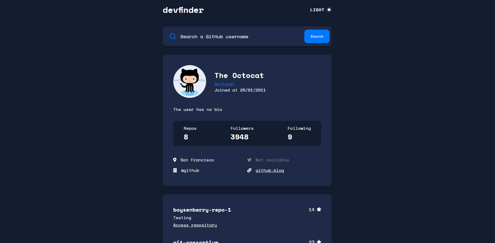

<div align="center"> 
  
</div>

<hr>
<br>

<div align="center"> 
  
</div>

### ✨ [Demo](https://devfinder-viniciuspatzer.netlify.app/)

<br>

## About

A simple and beautiful github profiles and repositories search engine.

## Features

- Search github users and lists all the informations along with the repositories as well.
- Dark mode and light mode.

## Technologies

The following tools were used in this project:

- [React](https://pt-br.reactjs.org/)
- [TypeScript](https://www.typescriptlang.org/)
- [Styled Components](https://styled-components.com/)

## Getting started

First of all, you need to have [Git](https://git-scm.com) and [Node](https://nodejs.org/en/) installed.

```bash
# Clone this project
$ git clone https://github.com/viniciuspatzer/dtmoney.git

# Access
$ cd dtmoney

# Install dependencies
$ yarn install

# Run the project
$ yarn start

# The server will initialize on the localhost
```
